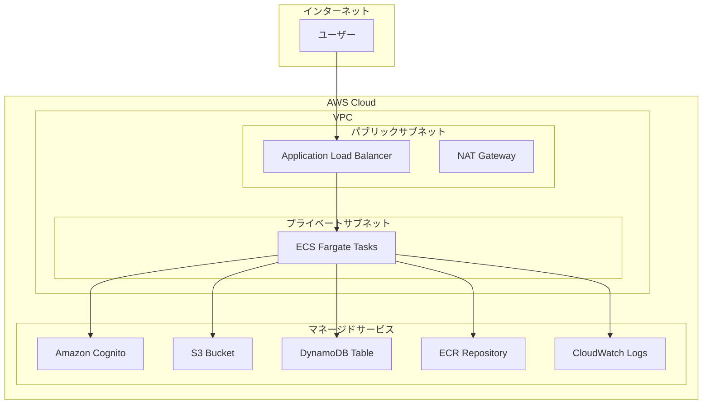

# Terraformインフラ設計書

## 概要

日本酒推薦サービス向けのAWSインフラをTerraformで構築します。Next.jsフルスタックアプリケーション（ECS）、認証（Cognito）、ストレージ（S3）、データベース（DynamoDB）、監視（CloudWatch）を含む包括的なインフラを提供します。AgentCore関連リソースは除外し、後続の実装で対応します。

## アーキテクチャ

### 全体構成図



### ネットワーク設計

- **VPC**: 10.0.0.0/16 CIDR
- **パブリックサブネット**: 2つのAZ（10.0.1.0/24, 10.0.2.0/24）
- **プライベートサブネット**: 2つのAZ（10.0.11.0/24, 10.0.12.0/24）
- **インターネットゲートウェイ**: パブリックサブネット用
- **NATゲートウェイ**: プライベートサブネットのアウトバウンド通信用

## コンポーネントと設計詳細

### 1. ネットワーキング（VPC）

**目的**: セキュアで分離されたネットワーク環境の提供

**設計決定**:
- マルチAZ構成による高可用性
- パブリック/プライベートサブネット分離によるセキュリティ強化
- NATゲートウェイによる安全なアウトバウンド通信

**リソース**:
- VPC（10.0.0.0/16）
- インターネットゲートウェイ
- パブリックサブネット × 2（各AZ）
- プライベートサブネット × 2（各AZ）
- NATゲートウェイ × 2（各AZ）
- ルートテーブル

### 2. ロードバランサー（ALB）

**目的**: HTTPS終端とトラフィック分散

**設計決定**:
- Application Load Balancerによるレイヤー7負荷分散
- HTTPS終端でセキュリティ強化
- ヘルスチェック機能による可用性向上

**リソース**:
- Application Load Balancer
- ターゲットグループ（ECS用）
- セキュリティグループ（HTTP/HTTPS許可）
- SSL証明書（ACM）

### 3. コンテナ実行環境（ECS）

**目的**: Next.jsアプリケーションのコンテナ実行

**設計決定**:
- Fargateによるサーバーレスコンテナ実行
- オートスケーリング機能による負荷対応
- ECRによるプライベートイメージレジストリ

**リソース**:
- ECSクラスター
- ECSサービス
- ECSタスク定義
- ECRリポジトリ
- IAMロール（タスク実行用、タスク用）
- セキュリティグループ（ALBからのアクセス許可）
- オートスケーリング設定

**タスク定義設定**:
- CPU: 512 (0.5 vCPU)
- メモリ: 1024 MB (1 GB)
- ネットワークモード: awsvpc
- ログドライバー: awslogs

### 4. 認証サービス（Cognito）

**目的**: ユーザー認証とアクセス制御

**設計決定**:
- ユーザープールによる認証管理
- JWT トークンによるステートレス認証
- Passkey（WebAuthn/FIDO2）によるパスワードレス認証
- 生体認証とセキュリティキー対応による強固なセキュリティ

**リソース**:
- Cognitoユーザープール
- Cognitoユーザープールクライアント
- Cognitoアイデンティティプール
- IAMロール（認証済み/未認証ユーザー用）

**設定**:
- Passkey認証: WebAuthn/FIDO2対応
- パスワードレス認証: Passkey優先、パスワードはフォールバック
- メール検証: 必須
- トークン有効期限: アクセストークン1時間、リフレッシュトークン30日
- 生体認証: 指紋、顔認証、セキュリティキー対応

### 5. ファイルストレージ（S3）

**目的**: 日本酒ラベル画像とメニュー画像の保存

**設計決定**:
- バージョニング有効化によるデータ保護
- ライフサイクルポリシーによるコスト最適化
- CORS設定によるWebアプリケーション対応

**リソース**:
- S3バケット
- バケットポリシー
- CORS設定
- ライフサイクル設定
- IAMポリシー（アプリケーション用）

**設定**:
- バージョニング: 有効
- 暗号化: AES-256
- パブリックアクセス: ブロック
- ライフサイクル: 90日後にIA、365日後にGlacier

### 6. データベース（DynamoDB）

**目的**: 飲酒記録とユーザーデータの保存

**設計決定**:
- NoSQLによる柔軟なデータモデル
- オンデマンド課金による コスト効率
- GSIによる効率的なクエリ対応

**リソース**:
- DynamoDBテーブル（飲酒記録用）
- Global Secondary Index
- IAMポリシー（アプリケーション用）

**テーブル設計**:

**DrinkingRecords テーブル**:
- パーティションキー: userId (String)
- ソートキー: recordId (String)
- 属性:
  - sake_name (String) - 銘柄
  - taste_impression (String) - 味の感想
  - rating (String) - 評価（4段階）
  - label_image_url (String) - ラベル画像URL
  - created_at (String) - 作成日時
  - updated_at (String) - 更新日時

**GSI設計**:
- GSI1: sake_name-created_at-index（銘柄による検索用）
- GSI2: rating-created_at-index（評価による検索用）

### 7. 監視・ログ（CloudWatch）

**目的**: アプリケーションの監視とログ管理

**設計決定**:
- 構造化ログによる効率的な分析
- メトリクスアラームによる障害検知
- ログ保持期間の設定によるコスト管理

**リソース**:
- CloudWatchロググループ
- CloudWatchアラーム
- SNSトピック（アラート用）
- VPCフローログ

**監視項目**:
- ECSタスクCPU使用率（閾値: 80%）
- ECSタスクメモリ使用率（閾値: 80%）
- ALBレスポンス時間（閾値: 3秒）
- DynamoDB読み書きエラー率
- S3 4xxエラー率

## セキュリティ設計

### ネットワークセキュリティ

**セキュリティグループ設計**:

1. **ALB用セキュリティグループ**:
   - インバウンド: HTTP(80), HTTPS(443) from 0.0.0.0/0
   - アウトバウンド: ECS用SGへのHTTP(8080)

2. **ECS用セキュリティグループ**:
   - インバウンド: HTTP(8080) from ALB用SG
   - アウトバウンド: HTTPS(443) to 0.0.0.0/0

3. **VPCエンドポイント用セキュリティグループ**:
   - インバウンド: HTTPS(443) from ECS用SG
   - アウトバウンド: なし

### IAMセキュリティ

**最小権限の原則**:
- ECSタスク実行ロール: ECR、CloudWatchログのみ
- ECSタスクロール: S3、DynamoDB、Cognitoの必要最小限
- Cognitoロール: 認証済みユーザーのみリソースアクセス

### データ保護

- S3: サーバーサイド暗号化（AES-256）
- DynamoDB: 保存時暗号化有効
- CloudWatch: ログ暗号化有効
- ALB: HTTPS強制リダイレクト

## パフォーマンス設計

### スケーリング戦略

**ECSオートスケーリング**:
- ターゲット追跡スケーリング
- CPU使用率70%でスケールアウト
- 最小タスク数: 2
- 最大タスク数: 10

**DynamoDBスケーリング**:
- オンデマンドモード
- 自動スケーリング有効

### キャッシュ戦略

- ALBでの静的コンテンツキャッシュ
- Next.jsビルトインキャッシュ活用
- S3での画像配信最適化

## コスト最適化

### リソース最適化

- ECS Fargate Spotインスタンス活用（開発環境）
- S3ライフサイクルポリシーによるストレージクラス移行
- CloudWatchログ保持期間設定（30日）
- 不要なNATゲートウェイの削減（単一AZ構成オプション）

### 監視とアラート

- AWS Cost Explorerによるコスト監視
- 予算アラート設定
- リソース使用率監視

## 災害復旧設計

### バックアップ戦略

- DynamoDB: ポイントインタイム復旧有効（35日間）
- S3: バージョニング有効
- ECS: イメージはECRで管理

### 復旧手順

1. DynamoDBテーブル復旧
2. S3バケット復旧
3. ECSサービス再デプロイ
4. DNS設定確認

## デプロイ戦略

### Terraform構成

**モジュール構造**:
```
infrastructure/
├── main.tf              # メイン設定
├── variables.tf         # 変数定義
├── outputs.tf          # 出力値
├── terraform.tfvars    # 環境固有値
└── modules/
    ├── networking/     # VPC、サブネット
    ├── security/       # セキュリティグループ、IAM
    ├── compute/        # ECS、ALB
    ├── storage/        # S3、DynamoDB
    ├── auth/          # Cognito
    └── monitoring/    # CloudWatch
```

### 環境管理

- 単一環境（prod）
- Terraform Cloudによる状態管理
- GitHub Actionsによる自動デプロイ

## 運用設計

### 監視ダッシュボード

**CloudWatchダッシュボード項目**:
- ECSサービス状態
- ALBメトリクス
- DynamoDBメトリクス
- S3メトリクス
- エラー率とレスポンス時間

### ログ管理

**ログ種別**:
- アプリケーションログ（ECS）
- アクセスログ（ALB）
- VPCフローログ
- CloudTrail（API呼び出し）

### アラート設定

**重要度別アラート**:
- Critical: サービス停止、高エラー率
- Warning: 高CPU使用率、長いレスポンス時間
- Info: デプロイ完了、スケーリングイベント

## 実装考慮事項

### 環境変数

**ECSタスクで設定する環境変数**:
- `COGNITO_USER_POOL_ID`
- `COGNITO_CLIENT_ID`
- `S3_BUCKET_NAME`
- `DYNAMODB_TABLE_NAME`
- `AWS_REGION`

### 接続情報

**アプリケーションからの接続**:
- DynamoDB: IAMロールベース認証
- S3: IAMロールベース認証
- Cognito: SDK経由でのJWT検証

### セキュリティベストプラクティス

- 全通信のHTTPS化
- IAMロールの最小権限設定
- セキュリティグループの厳格な設定
- 定期的なセキュリティ監査